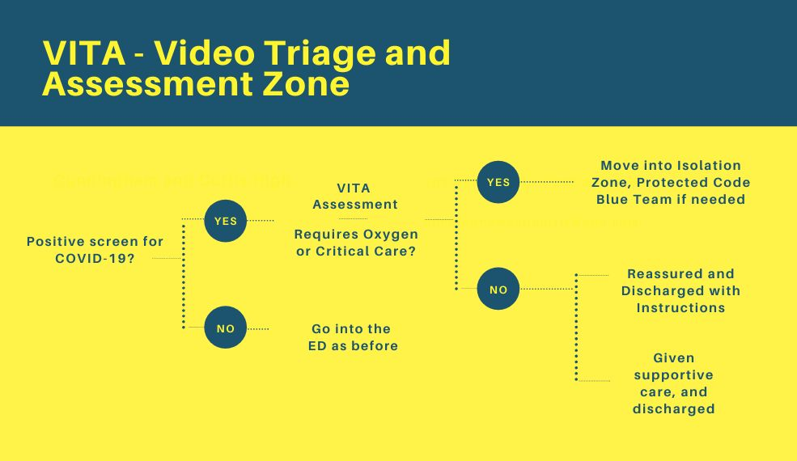
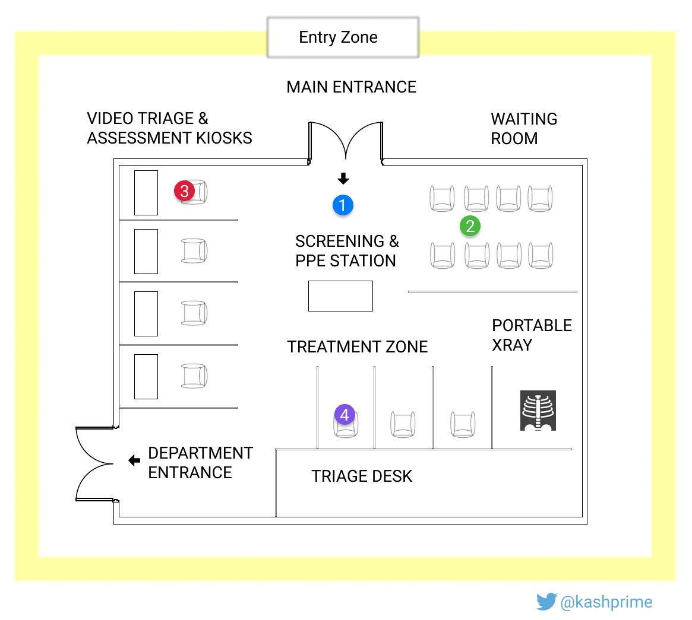
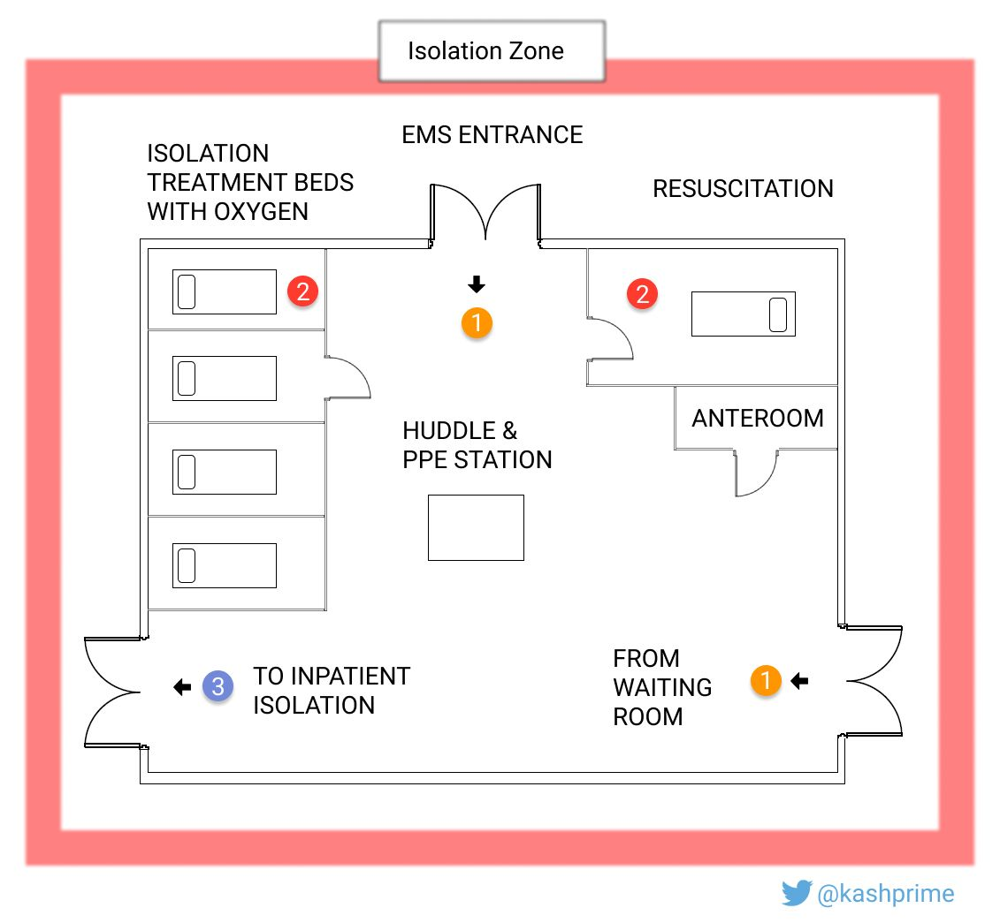
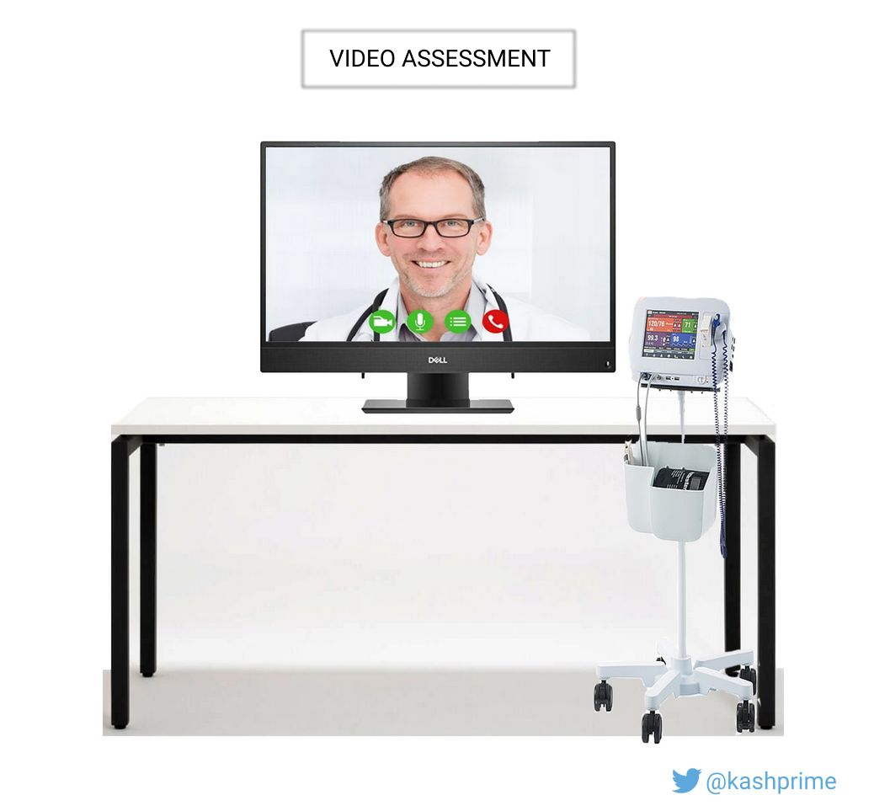

# Video Triage and Assessment (ViTA)
## A Proposal for Video Triage and Management of Large Numbers of Patients with CoVID-19 symptoms

The Video Linked to this image gives a quick summary of this proposal.

Given the exponential increase in reported CoVid-19 cases, we can expect large numbers of patients to present to Emergency Departments with viral symptoms. The vast majority of these will be benign self-limiting conditions, however sheer numbers can quickly overwhelm even the most cautious of PPE planning in our department. Given the international shortage of N95 respirators, we can expect that community physicians will be unable to safely see and screen most of these patients.

Proposed is the creation of a rapid assessment zone where assessment by both nursing and physicians is done through video interface. Pre-printed order sets, on-site portable chest x-ray, and point-of-care blood tests will help identify the minority of patients needing more than gentle reassurance and comfort care. This model can serve as an example and be replicated in other healthcare settings, and can be placed in community settings as some authorities did in the previous SARS and pandemic flu clinics.

## Goals

- Quickly identify critically ill patients, potential super-spreaders
- Keep patients from infecting other patients
- Keep vulnerable patients safe
- Keep staff safe

One of the biggest advantages of this approach is the conservation of PPE, and creating a high-vigilance zone in the ED. Healthcare workers bore the brunt of SARS, whether it was developing severe viral pneumonia or from the exhausting emotional toil. The SARS Commission recognized that fundamentally there was a collective failure to anticipate the dangers to staff and address them in a timely manner.

## Layout and Flow

We envision converting space in a waiting room and repurposing it:

1.  A patient enters the emergency department through the main entrance.
    
2.  They are directed by a greeter wearing full PPE; a surgical procedure mask is placed on the patient and visitors. They are asked basic screening questions.
    
3.  They are placed in a queue for an assessment kiosk. This assessment is done by video, with the user obtaining their own vital signs using provided equipment. Assessment is initially completed by a nurse who does the triage assessment, and then a physician who obtains a history, and formulates a diagnosis and treatment plan, all on video.
    
4.  Once initial assessment is completed, patients are placed in a number of care pathways.

Once patients needing hospitalization are identified, they are placed in an isolation area of the ED.  Supportive care is provided, and a protected space is ready for resuscitation.  All providers in this area will be wearing full PPE to guard against aerosolization produced during high risk procedures (intubation).

## Technical Considerations

A number of companies offer commercial telemedicine solutions. Obtaining delivery and evaluating these for purchase will take weeks. For the moment we can immediately use commercially available tablets such as the iPad Pro. Using a modified stethoscope connected to a microphone, we can capture heart and lung sounds and physically examine the patient without exposing healthcare workers.

